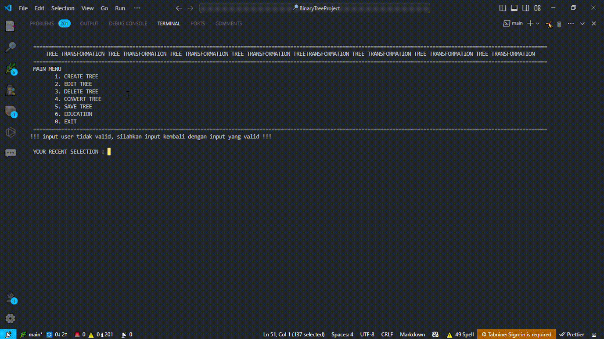
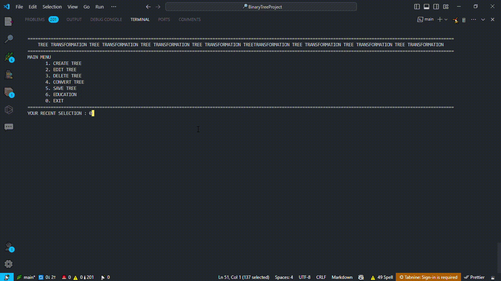
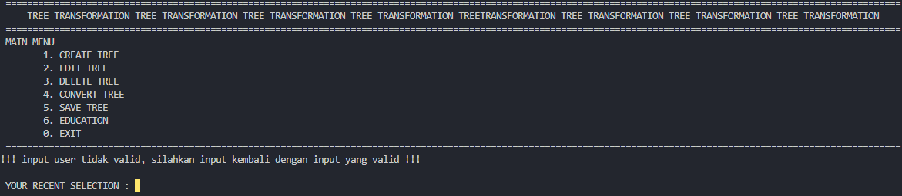

<h1 align="center">TRANSFORMING NON BINARY TREE TO BINARY TREE</h1>
<p align="center">
  <em>With <code>AVL</code> Methode</em>
</p>
<p align="center">
<a href="https://app.codecov.io/gh/eli64s/readme-ai">
    
  </a>
  <a href="https://github.com/eli64s/readme-ai/actions">
    
  </a>
</p>
<details>
  <summary>Table of Contents</summary>

- [📍 Overview](#-overview)
- [👾 Demo](#-demo)
- [🧩 Features](#-features)
- [🚀 Getting Started](#-getting-started)
- [⚙️ Installation](#-installation)
- [🤖 Usage](#-usage)
- [🧑‍💻 Contributing](#-contributing)
</details>

---

## 📍 Overview

***Penjelasan Singkat***

Program yang dibuat memiliki fungsi utama untuk mengubah sebuah Non Binary Tree ke Binary Tree dan melakukan balancing sebuah Binary Tree hasil konversi dengan menerapkan algoritma (Adelson-Velsky and Landis) AVL. 

***Sedikit Pembahasan Fitur***

Program juga menyediakan fitur-fitur pada umumnya yang ada pada Abstract Data Type Tree seperti fungsi traversal, penetapan level/tingkat tree, kedalaman, dan pencarian suatu node. Selain itu proses manipulation file juga diterapkan untuk menyimpan Non Binary Tree ke dalam sebuah file juga membaca Non Binary Tree dari sebuah file.<br>

> [!IMPORTANT]
>
> <sub>Program _TRANSFORMATION NON BINARY TREE TO BINARY TREE WITH AVL METHODE_ Ini Masih Dalam Perkembangan. Tunggu Update Terbaru Terkait Perkembangan Program Ini!</sub>

---

## 👾 Demo

**Create Tree:**


**Transformation Tree:**


**EducationNBT Tree:**


**Save Tree:**


> [!TIP]
>
> <sub>Gunakan Code Editor Kesayangan Anda Agar Program Bisa Dijalankan Sesuai Dengan Keinginan!</sub>

---

## 🧩 Features

**Main Menu:**

* Create Tree
* Edit Tree
* Delete Tree
* Convert Tree
* Save Tree
* Education

---

## 🚀 Getting Started

**System Requirements:**

  - C/C++ Language

**Repository URL or Local Path:**

Make sure to have a repository URL or local directory path ready for the CLI.

- [**GitHub**](https://github.com/)

---

### ⚙️ Installation
**Cloning Project**
#### Using `Command Prompt`
> Clone repository and change directory.
> ```console
> $ git clone https://github.com/Fanzaatsila/BinaryTreeProject.git
> ```

---

### 🤖 Usage

**Run Program**

#### Using `Visual Studio Code`
> Clone repository and change directory.
> ```console
> g++ -o main main.cpp body.cpp ui.cpp
> ```

---

## 🧑‍💻 Contributing
To grow the project, we need your help! See the links below to get started.

- [🔰 Contributing Guide][1]
- [👋 Start a Discussion][2]
- [🐛 Open an Issue][3]

<br>
Program Ini Dibuat Oleh :<br>
Kami Mahasiswa Politeknik Negeri Bandung (POLBAN)<br>
Jurusan Teknik Komputer dan Informatika<br>
Prodi D4 - Teknik Informatika<br>
- Faisal Bashri Albir (231524042)<br>
- Fanza Atsila Fizarli (231524043)<br>
- Hanif Ahmad Rizqullah (231524045)<br>
<br>
<p align="left">
  <a href="https://github.com{/Fanzaatsila/BinaryTreeProject/}graphs/contributors">
    
  </a>
</p>

---